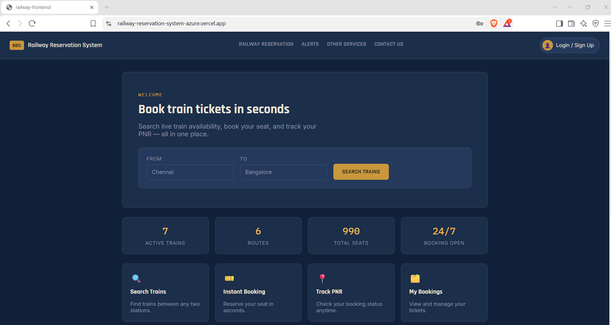
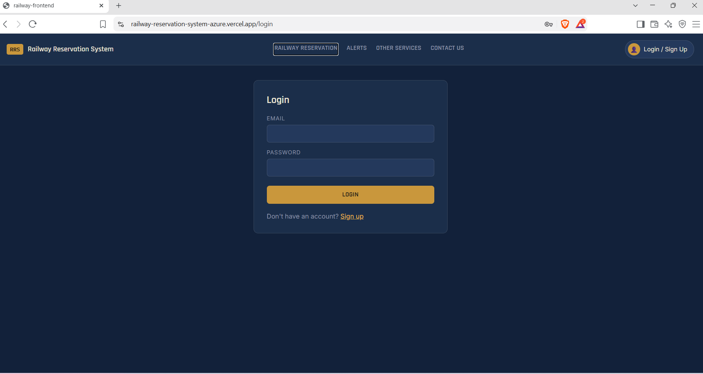
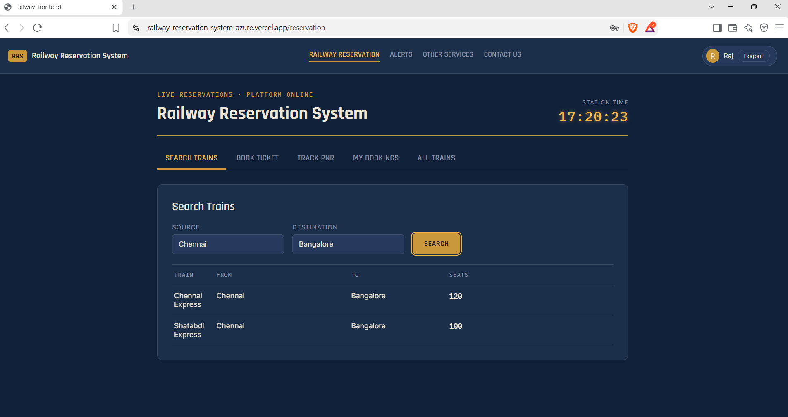
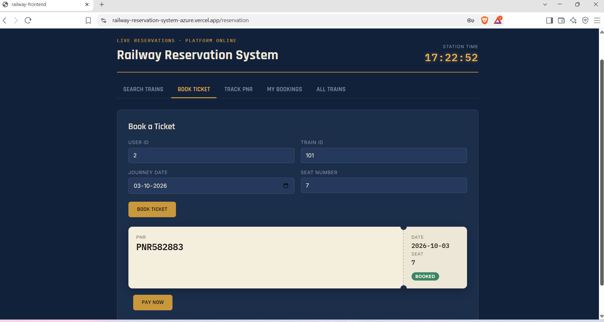
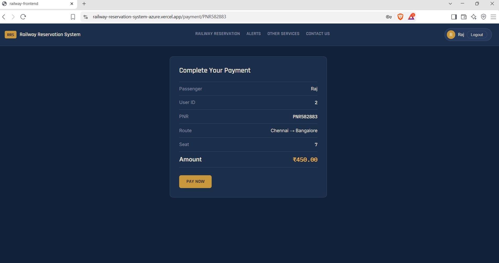
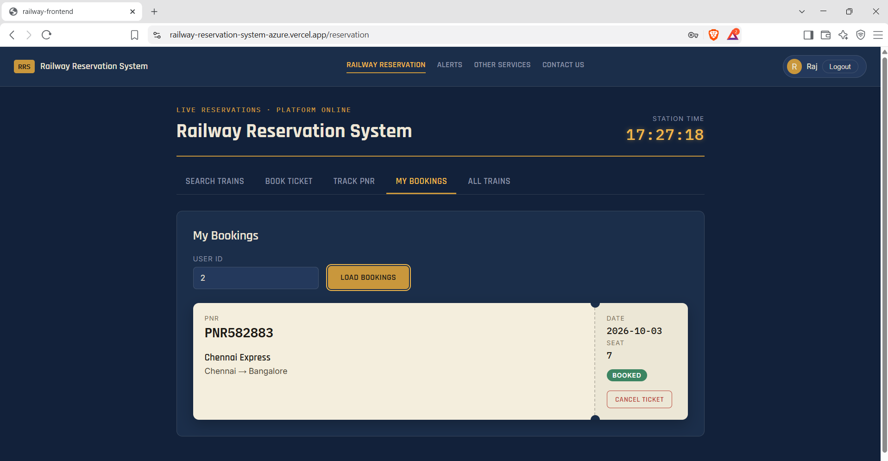
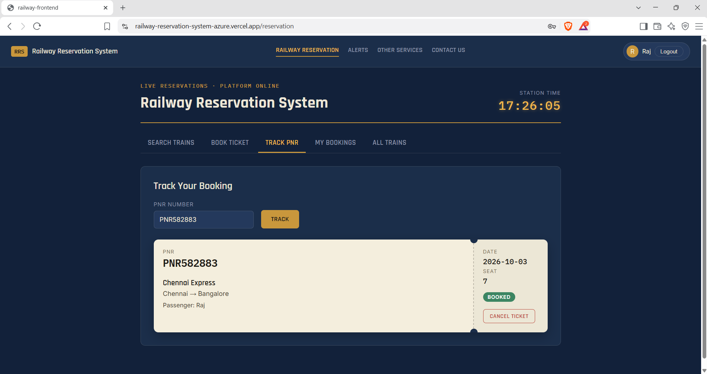
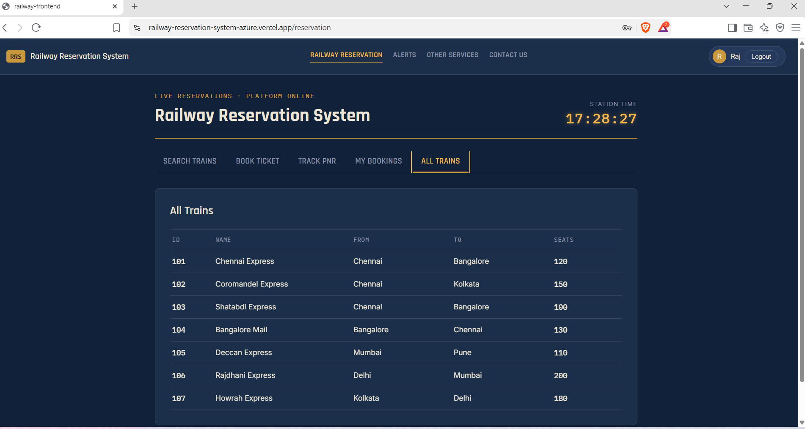

# Railway Reservation System

A full-stack railway reservation system built with React, Spring Boot, and MySQL. Users can search trains, book tickets, pay, track PNR status, and manage or cancel their bookings.

## Live Demo

- **Frontend:** [railway-reservation-system-azure.vercel.app](https://railway-reservation-system-azure.vercel.app/)
- **Backend API:** [railway-reservation-system-sup2.onrender.com](https://railway-reservation-system-sup2.onrender.com/)

The backend runs on a free Render instance, so the first request can take 50 seconds or more to wake up. The database is on Aiven's free plan, which powers off after a period of inactivity, so if the app shows no data, the database may need to be powered on again.

## Screenshots

| Home | Login |
|---|---|
|  |  |

| Search trains | Book ticket |
|---|---|
|  |  |

| Payment | My bookings |
|---|---|
|  |  |

| Track PNR | All trains |
|---|---|
|  |  |

## Features

- User registration and login
- JWT-based authentication
- Train search
- Train details and availability
- Railway ticket booking
- Payment step before confirmation
- Booking management
- PNR tracking
- Ticket cancellation
- User booking history
- RESTful APIs
- React-based frontend

## Technologies Used

**Frontend**
- React.js
- JavaScript
- HTML5
- CSS3
- Vite

**Backend**
- Java
- Spring Boot
- Spring Data JPA
- Spring Security
- JWT
- Maven

**Database**
- MySQL

**Tools**
- Visual Studio Code
- Eclipse
- Postman
- Git & GitHub

## Deployment

- **Frontend:** Deployed on [Vercel](https://vercel.com/)
- **Backend:** Deployed on [Render](https://render.com/)
- **Database:** Hosted on [Aiven](https://aiven.io/)

## Project Structure

- `railway-frontend/` — React frontend
- `railway-reservation-springboot/` — Spring Boot backend
- `docs/` — Project screenshots

## Future Improvements

1. **Remove manual User ID and Train ID entry.**
   Currently the booking form asks for a user ID and a train ID, which a new user does not know. Planned fix: read the user from the logged-in JWT token so no user ID is needed, and let the user pick a train from the search results or the All Trains list with a "Book" button that fills in the train automatically.

2. **Email confirmation after payment.**
   Send the user an email with the PNR, train name, route, date, passenger details and amount paid once payment succeeds (Spring Boot Mail with an SMTP provider such as Gmail or Brevo).

3. **Email on ticket cancellation.**
   Send a cancellation email with the PNR, cancelled journey details and refund information whenever a booking is cancelled.

4. **Real payment gateway with refunds.**
   Replace the simulated payment step with a gateway such as Razorpay (test mode first). Verify payments on the server side and trigger an automatic refund when a ticket is cancelled.

5. **Seat selection and waiting list.**
   Let users choose seats from a visual seat map and assign seat or berth numbers per passenger. When a train is full, add bookings to a waiting list and confirm them automatically when a cancellation frees a seat.

6. **Smaller improvements.**
   - Pagination for train and booking lists
   - Admin panel to add, edit and remove trains and schedules
   - Unit and integration tests
